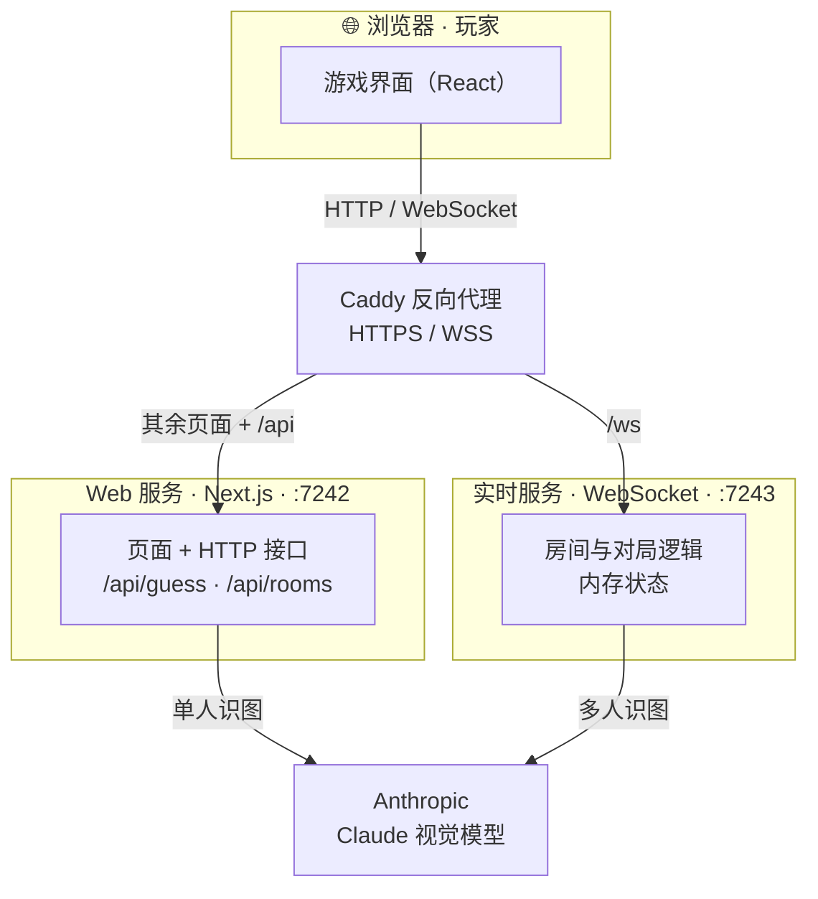
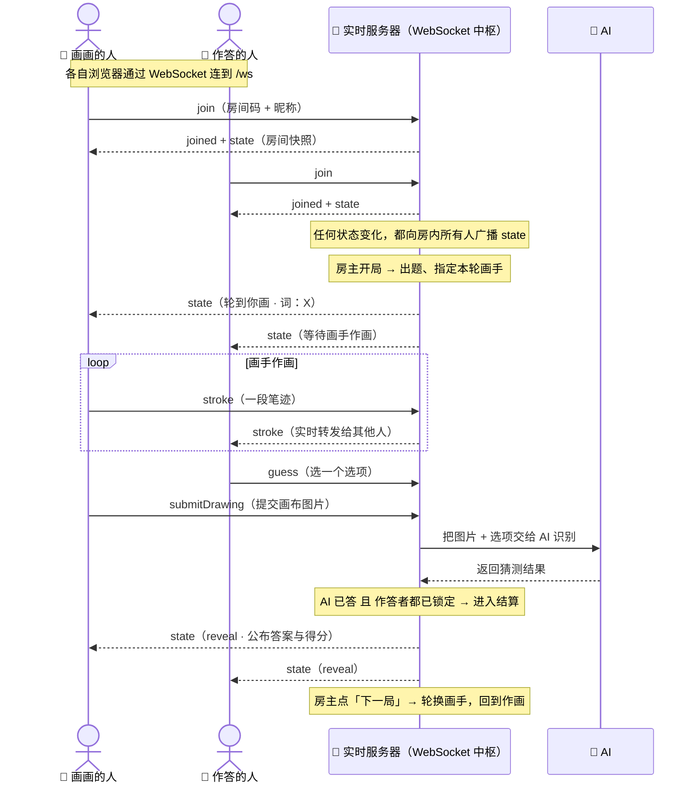
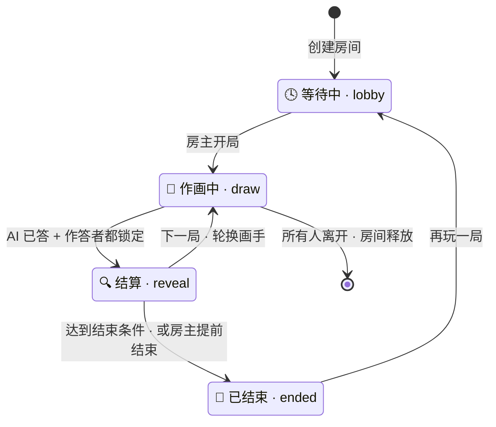

# Deviation Game · 技术设计文档（给工程）

> 面向开发者。三张图说清系统：**技术架构**、**WebSocket 交互**、**房间状态**。图用 [Mermaid](https://mermaid.js.org/) 绘制，GitHub 可直接渲染。

---

## 1. 技术架构图

**说明**

- **两个后端服务，各司其职**：
  - **Web 服务（Next.js）**——无状态。负责页面、单人模式的 AI 接口（`/api/guess`）、以及房间列表代理（`/api/rooms`）。
  - **实时服务（WebSocket）**——有状态。负责多人房间：连接、笔迹同步、出题、计分、对局推进；房间状态全部在内存里。
- **为什么拆两个**：Next.js 不擅长长连接，而实时对局需要常驻 WebSocket。拆开后二者可独立重启/扩缩容，互不影响。
- **Caddy 统一入口**：自动 HTTPS，把 `/ws` 路由到实时服务、其余到 Web 服务；浏览器只看到一个域名。
- **AI 在服务端调用**：视觉模型由后端调用（密钥不进浏览器），单人与多人共用同一套识图逻辑。

---

## 2. WebSocket 交互流程图

> 三个角色：🎨 **画画的人**、🙋 **作答的人**、🤖 **AI**。它们都不直接对话，而是通过**实时服务器**这个 WebSocket 中枢交互。下图从「加入房间」开始，走完一整局。

**说明（WebSocket 怎么运作）**

- **持久连接**：每个浏览器与实时服务器保持一条 WebSocket 长连接（`/ws`），双向随时收发，不必反复发 HTTP。
- **服务器是唯一真相源**：客户端只发「意图」消息，服务器据此更新房间状态，再把最新 `state` **广播**给房内每个人；界面永远跟随推送的 `state` 渲染。
- **客户端 → 服务器**：`join`、`start`（房主开局）、`stroke`（一段笔迹）、`guess`（作答）、`submitDrawing`（交给 AI）、`next`/`end`（下一局/结束）。
- **服务器 → 客户端**：`state`（按观看者裁剪，非画手在结算前看不到答案）、`stroke`（转发他人笔迹）、`replay`（中途加入/重连时回放当前画面）。
- **实时同步靠转发**：画手每画一笔就发一条 `stroke`，服务器原样转发，于是大家「同屏」看到作画过程。
- **AI 不是 WebSocket 客户端**：它由服务器在「画手提交」后调用，结果并入房间状态再广播；何时结算由服务器判断（AI 已答 + 所有在线作答者都锁定）。

---

## 3. 房间状态图

**说明**

| 阶段 | 含义 | 主要操作 |
| --- | --- | --- |
| `lobby` | 等人 + 房主配置玩法 | 房主：选结束方式与参数、选类别开局 |
| `draw` | 画手作画，其他人随时抢答 | 画手：画 + 提交；作答者：锁定一次猜测 |
| `reveal` | 公布答案与本局得分 | 房主：下一局 / 提前结束 / 查看最终结果 |
| `ended` | 展示最终比分与胜负 | 房主：再玩一局（回到 `lobby`） |

- **进入结算（draw → reveal）**：AI 已给出猜测、且所有在线作答者都锁定答案时自动结算。
- **结束（→ ended）**：到达结束条件（固定局数玩满，或抢分有阵营达标），或房主随时「提前结束」。
- **房间释放**：房间里所有人离开后自动清空（状态在内存，进程重启也会清空）。
