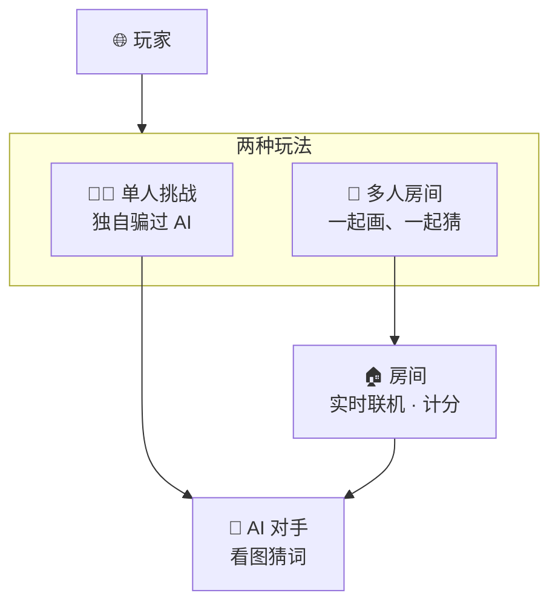
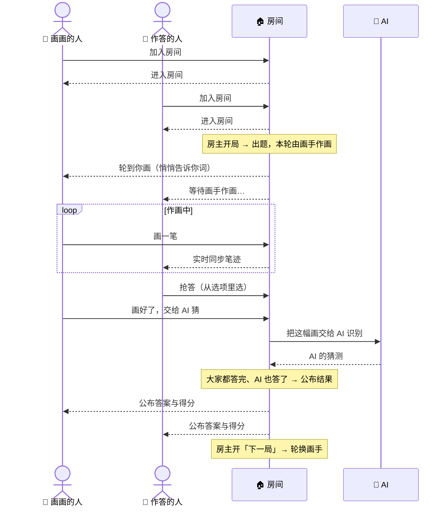
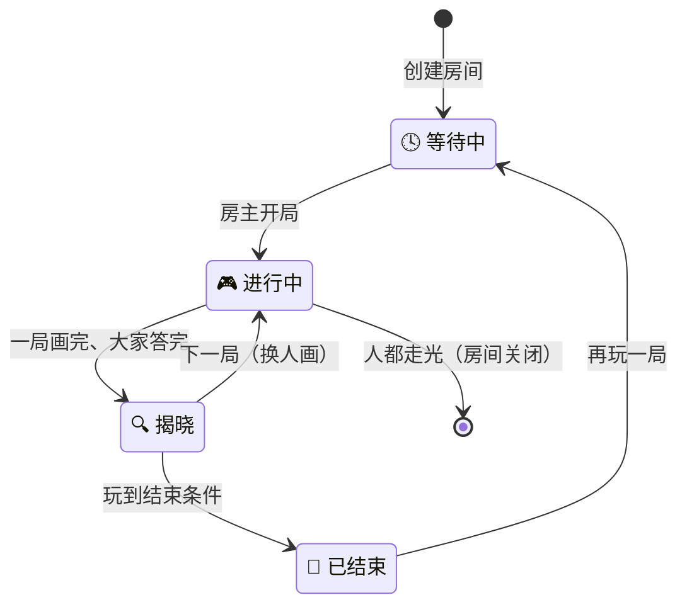

# Deviation Game · 产品设计文档（给产品）

> 一个「反向你画我猜」：画得**让人一眼懂、却让 AI 猜不出**就赢。支持单人挑战与多人房间。
>
> 面向产品/非技术读者。用三张图说清：**系统由什么组成**、**玩家是怎么互动的**、**一个房间会经历哪些阶段**。

---

## 1. 产品组成

**说明**

- 产品有两种玩法：**单人挑战**（自己对抗 AI）和**多人房间**（一桌人一起玩）。
- 多人玩法发生在**房间**里：房间让所有人实时看到彼此的操作，并完成计分。
- **AI 对手**贯穿两种玩法——既是竞争对手，也负责判断「这幅画到底骗没骗过它」。

---

## 2. 玩家互动流程

> 一个房间里有三个角色：🎨 **画画的人**、🙋 **作答的人**、🤖 **AI**。他们都围绕「房间」互动——房间负责把每个人的动作实时同步给其他人。下图从「加入房间」开始，走完一整局。

**说明**

- **谁画、谁猜每轮轮换**：每个人都会轮流当画手、也轮流当作答者。
- **画面实时同步**：画手每画一笔，其他人立刻在同一块画布上看到——像围在一起看人现场作画。
- **AI 与人同场竞猜**：画手画完后，把画交给 AI 识别；AI 的猜测和大家的答案一起在「揭晓」时公布。
- **房主把控节奏**：开局、进入下一局、提前结束都由房主操作。
- **始终同屏一致**：房间里所有人看到的画面始终一致、实时更新，不会各看各的。

---

## 3. 房间会经历的阶段

**说明**

| 阶段 | 玩家看到/能做 |
| --- | --- |
| 🕓 等待中 | 等人进房；房主设置玩法（玩几局 / 抢多少分）并开局 |
| 🎮 进行中 | 画手作画，其他人随时抢答 |
| 🔍 揭晓 | 公布答案、本局得分；房主选择下一局或结束 |
| 🏁 已结束 | 展示最终比分与胜负，房主可「再玩一局」 |

- **何时揭晓**：当 AI 给出猜测、且在场作答者都答完，本局自动揭晓。
- **何时结束**：玩满约定局数，或有一方先达到目标分；房主也能随时提前结束。
- **房间自动回收**：当房间里所有人都离开，房间会自动关闭。
