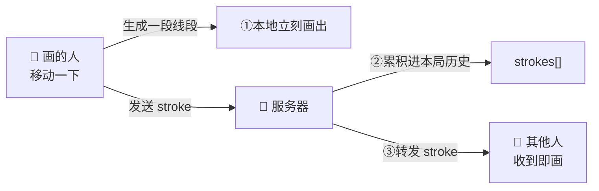

# 技术细节 · 问答（Q&A）

> 这是一份**问答文档**：每一节都是一个你问过的问题，下面给出具体解释。需要新增问题时直接问我，我就在这里追加一节。

## 目录

1. 笔迹（stroke）是怎么设计、怎么同步的？
2. AI 在整个体验中扮演什么角色？（核心引擎 还是 辅助增强？）
3. Prompt / Agent 是怎么设计的？（多轮？多角色？技巧？）
4. 100 人同时玩，架构上要做什么改变？

---

## 1. 笔迹（stroke）是怎么设计、怎么同步的？

### 1.1 一段「笔迹」长什么样

笔迹的最小单位不是「一整条线」，而是**一小段线段**。数据结构（`packages/shared/src/types.ts`）：

```ts
interface Stroke {
  x0, y0   // 线段起点
  x1, y1   // 线段终点
  color    // 颜色
  size     // 粗细（橡皮为固定 26）
  erase?   // 是否橡皮
}
```

手指/鼠标每移动一点点，就生成**一段** `(x0,y0) → (x1,y1)` 的线段。一条连续的线，其实是由很多首尾相接的小线段拼出来的。每段都自带颜色和粗细，所以**互相独立**、不依赖「当前画笔状态」。

### 1.2 坐标是「设备无关」的

画布内部用一个固定分辨率的坐标系：**720 × 720**。落笔时把屏幕像素换算成这个固定坐标：

```
x = (鼠标X - 画布左边) / 画布显示宽度 × 720
```

这样不管谁的屏幕多大、是手机还是电脑，大家用的都是同一套 0–720 坐标。**好处**：同一段笔迹在所有设备上画出来位置一致，不会因为屏幕尺寸不同而变形。

### 1.3 三方各做什么（同步原理）



- **画的人（drawer）**：每移动一下，本地**立刻**把这段线段画到自己画布上（不等服务器，零延迟手感），同时把这段 `stroke` 发给服务器。
- **服务器**：把收到的每段 `stroke` ①追加到本局的笔迹历史 `strokes[]`，②**原样转发**给房间里其他所有人（不回发给画的人自己，避免重复画）。
- **其他人（watcher）**：收到一段就画一段。于是大家几乎**实时**看到这幅画「一笔一笔长出来」。

> 关键点：服务器只是个「转发 + 记录」的中枢，它不理解画的内容，只负责把每一小段广播出去并存档。

### 1.4 中途加入 / 断线重连：整幅重放

新人中途进房、或有人断线重连时，他错过了前面所有线段。服务器会把**本局已累积的全部线段**一次性发给他（`replay`），客户端先清空画布、再按顺序把这些线段重画一遍 —— 于是他立刻看到当前完整的画面，和别人对齐。

### 1.5 清空与换局

- 画的人点「清空」：发一条 `clear`，服务器把 `strokes[]` 清空并广播，所有人画布一起变白。
- 每开新一局：服务器重置该局的 `strokes[]`，画布从空白开始。

### 1.6 为什么这么设计（取舍）

- **用「线段」而不是「整条路径」**：可以边画边发、边收边画，看的人不用等整条线画完，实时感最好；每段自带样式，重放只需「在白底上按顺序重画所有线段」，逻辑极简。
- **本地先画（乐观渲染）**：画的人不等服务器回包，手感跟手；服务器转发时跳过发送者本人，避免重复绘制。
- **固定坐标系**：把「同步一致性」收敛到一个与设备无关的坐标空间，跨端不变形。
- **代价**：每次移动都发一条小消息，消息量偏多。对当前规模完全够用；将来要省流量，可以把短时间内的多段合并成一批再发（暂不需要）。

### 1.7 直线段怎么拼成曲线？

每段确实是「起点直连终点」的直线，曲线是靠**又短又多**的小直线段拼出来的：

1. **采样很密**：手指/鼠标每移动一下就触发一次事件（一秒几十上百次），相邻两次之间只挪了几个像素，所以每段都很短。
2. **首尾相接**：下一段的起点 = 上一段的终点，段与段之间不留缝。
3. **短直线近似曲线**：一条弯线 ≈ 很多短直线段拼成的折线，段越短越贴近真实轨迹——屏幕上任何曲线最终也是一小段一小段拼出来的。
4. **圆角笔帽磨平拐角**：每段用「圆头」绘制（`lineCap: round`），两端是半圆；相邻两段在交点处的半圆互相重叠，既不留缝，又把折线的尖角磨圆。

```
真实轨迹（弯）        实际画出（短直线段 + 圆头）
   ╭─╮                P0─P1─P2─P3
  ╯   ╰                 ╲      ╱
                         P5──P4     （段够短时，肉眼即顺滑曲线）
```

> 结论：**画得越慢，段越短越平滑；画得越快，段越长，可能略显「折线感」**。要进一步平滑，可在相邻点间做插值或改用贝塞尔曲线（目前正常手速下已足够顺，未做）。

---

## 2. AI 在整个体验中扮演什么角色？（核心引擎 还是 辅助增强？）

**结论：核心，而非辅助。** 但它的「核心」体现在玩法与判定层，系统骨架仍是普通工程。

- **它既是对手，也是裁判**：整套胜负规则都围绕「AI 有没有被骗过」定义——AI 猜错 → 人类阵营得分；AI 猜对 → AI 阵营得分。拿掉 AI，游戏的目标就不成立了（你要骗的那个对象没了）。所以它不是「锦上添花的增强」，而是玩法的根基。
- **但它很「薄」**：每局只调用一次，做一件很小的事——看一张涂鸦，从 4 个选项里四选一。房间、实时同步、计分流程都是确定性的普通代码，不依赖 AI 运行。
- **一句话**：系统骨架是工程，灵魂是 AI。调用虽薄，却**承重**——它定义了这个游戏存在的意义。
- **而且没被它绑死**：没配密钥或调用失败时走 mock 兜底，游戏照样能跑（只是 AI 变成固定/兜底答案）。所以 AI 是「核心玩法引擎」，但系统对它做了优雅降级，不会因 AI 挂了就玩不了。

---

## 3. Prompt / Agent 是怎么设计的？（多轮？多角色？技巧？）

**一句话：不是 Agent，也不是多轮 / 多角色，而是一次「结构化的图像四选一分类」调用。** 故意做得又轻又确定（见 `packages/shared/src/guesser.ts`）。

- **单次、单轮、单角色**：一条 user 消息，里面放 [一张图片 + 一段文字]。没有多轮对话、没有多智能体、没有工具循环。
- **提示词内容**：告诉它本轮类别（生物/物品/…），列出 4 个选项，要求「只能从选项里选一个，并给 0–100 的信心值 + 10 字内中文理由」。
- **结构化输出（关键技巧）**：用 JSON Schema 约束输出 `{guess, confidence, reasoning}`，其中 `guess` 是**枚举**、只能取那 4 个选项之一 → AI 不可能蹦出选项外的答案，也省掉脆弱的文本解析。
- **省时省钱的设置**：关闭思考（thinking disabled）、用最便宜的 Haiku、图片用低清（`detail: low`）——任务简单，不需要重推理。
- **兜底**：无密钥/异常 → 返回 mock，保证可用。

**为什么不上多轮 / Agent**：任务本质就是「一张图四选一」，单次分类已经够用；多轮或 Agent 只会徒增延迟和成本、没有收益。以后若想让 AI 更「难骗」或更有个性，主要在**提示词**和**模型档位**上调（换更强模型、加风格化理由），而不是改成 Agent。

---

## 4. 100 人同时玩，架构上要做什么改变？

**先说结论：单看「100 人并发」，基本不用改架构。** 一个 Node WebSocket 进程轻松扛几千条连接，100 人（分散在十几二十个房间里）很轻，瓶颈不在连接数。

真正要改的，是当「100 人」意味着「要规模化 / 高可用 / 不停机」时——核心矛盾是现在的**有状态单点**（房间全在单进程内存里）：

1. **房间状态：内存 → Redis**。放进共享存储，这样①能多实例②重启/发版不丢正在进行的局。
2. **实时服务：单实例 → 多实例**（横向扩展、去单点）。跨实例广播两条路线：
   - **粘性会话（sticky session）**：把同一房间的连接固定路由到同一实例，广播仍在进程内（简单）；
   - **Redis pub/sub**：实例之间订阅转发 stroke/state（更灵活）。
3. **滚动发布**：现在 watchtower 重启会清掉进行中的房间；有了 Redis 状态后可以滚动更新、不掉线。
4. **AI 侧**：调用是「每局一次」（随房间数增长，不随人数），但仍要加**限流 / 重试 / 排队**应对速率限制与成本，必要时缓存或降级。
5. **笔迹流量**：stroke 是「按房间」广播（只发给同房的人），不是发给全部 100 人，所以没问题；只有当单个房间观众极多时，才考虑把多段合并成批再发。
6. **配套**：加监控/压测，按 CPU/内存横向扩容。

> 一句话：100 人不用动；要「认真做规模」时，把「单进程内存房间」换成「Redis 共享状态 + 多实例 + 粘性会话/订阅广播」，AI 侧加限流。
