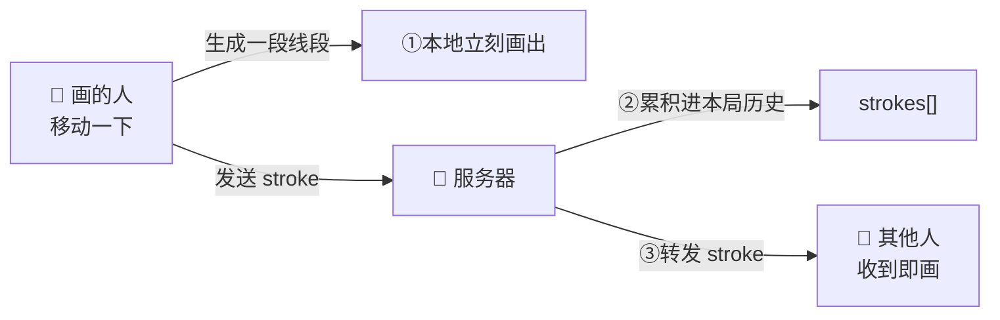

# 技术细节 · 深入解析

> 这份文档专门放「某个实现细节到底是怎么设计/怎么运作的」。需要时直接告诉我要解析的点（例如「重连是怎么做的」「AI 识图的提示词怎么构造」），我就在这里追加一篇。

## 目录

- [1. 笔迹（stroke）的设计与实时同步](#1-笔迹stroke的设计与实时同步)

---

## 1. 笔迹（stroke）的设计与实时同步

### 1.1 一段「笔迹」长什么样

笔迹的最小单位不是「一整条线」，而是**一小段线段**。数据结构（`packages/shared/src/types.ts`）：

```ts
interface Stroke {
  x0, y0   // 线段起点
  x1, y1   // 线段终点
  color    // 颜色
  size     // 粗细（橡皮为固定 26）
  erase?   // 是否橡皮
}
```

手指/鼠标每移动一点点，就生成**一段** `(x0,y0) → (x1,y1)` 的线段。一条连续的线，其实是由很多首尾相接的小线段拼出来的。每段都自带颜色和粗细，所以**互相独立**、不依赖「当前画笔状态」。

### 1.2 坐标是「设备无关」的

画布内部用一个固定分辨率的坐标系：**720 × 720**。落笔时把屏幕像素换算成这个固定坐标：

```
x = (鼠标X - 画布左边) / 画布显示宽度 × 720
```

这样不管谁的屏幕多大、是手机还是电脑，大家用的都是同一套 0–720 坐标。**好处**：同一段笔迹在所有设备上画出来位置一致，不会因为屏幕尺寸不同而变形。

### 1.3 三方各做什么（同步原理）



- **画的人（drawer）**：每移动一下，本地**立刻**把这段线段画到自己画布上（不等服务器，零延迟手感），同时把这段 `stroke` 发给服务器。
- **服务器**：把收到的每段 `stroke` ①追加到本局的笔迹历史 `strokes[]`，②**原样转发**给房间里其他所有人（不回发给画的人自己，避免重复画）。
- **其他人（watcher）**：收到一段就画一段。于是大家几乎**实时**看到这幅画「一笔一笔长出来」。

> 关键点：服务器只是个「转发 + 记录」的中枢，它不理解画的内容，只负责把每一小段广播出去并存档。

### 1.4 中途加入 / 断线重连：整幅重放

新人中途进房、或有人断线重连时，他错过了前面所有线段。服务器会把**本局已累积的全部线段**一次性发给他（`replay`），客户端先清空画布、再按顺序把这些线段重画一遍 —— 于是他立刻看到当前完整的画面，和别人对齐。

### 1.5 清空与换局

- 画的人点「清空」：发一条 `clear`，服务器把 `strokes[]` 清空并广播，所有人画布一起变白。
- 每开新一局：服务器重置该局的 `strokes[]`，画布从空白开始。

### 1.6 为什么这么设计（取舍）

- **用「线段」而不是「整条路径」**：可以边画边发、边收边画，看的人不用等整条线画完，实时感最好；每段自带样式，重放只需「在白底上按顺序重画所有线段」，逻辑极简。
- **本地先画（乐观渲染）**：画的人不等服务器回包，手感跟手；服务器转发时跳过发送者本人，避免重复绘制。
- **固定坐标系**：把「同步一致性」收敛到一个与设备无关的坐标空间，跨端不变形。
- **代价**：每次移动都发一条小消息，消息量偏多。对当前规模完全够用；将来要省流量，可以把短时间内的多段合并成一批再发（暂不需要）。

### 1.7 直线段怎么拼成曲线？

每段确实是「起点直连终点」的直线，曲线是靠**又短又多**的小直线段拼出来的：

1. **采样很密**：手指/鼠标每移动一下就触发一次事件（一秒几十上百次），相邻两次之间只挪了几个像素，所以每段都很短。
2. **首尾相接**：下一段的起点 = 上一段的终点，段与段之间不留缝。
3. **短直线近似曲线**：一条弯线 ≈ 很多短直线段拼成的折线，段越短越贴近真实轨迹——屏幕上任何曲线最终也是一小段一小段拼出来的。
4. **圆角笔帽磨平拐角**：每段用「圆头」绘制（`lineCap: round`），两端是半圆；相邻两段在交点处的半圆互相重叠，既不留缝，又把折线的尖角磨圆。

```
真实轨迹（弯）        实际画出（短直线段 + 圆头）
   ╭─╮                P0─P1─P2─P3
  ╯   ╰                 ╲      ╱
                         P5──P4     （段够短时，肉眼即顺滑曲线）
```

> 结论：**画得越慢，段越短越平滑；画得越快，段越长，可能略显「折线感」**。要进一步平滑，可在相邻点间做插值或改用贝塞尔曲线（目前正常手速下已足够顺，未做）。
